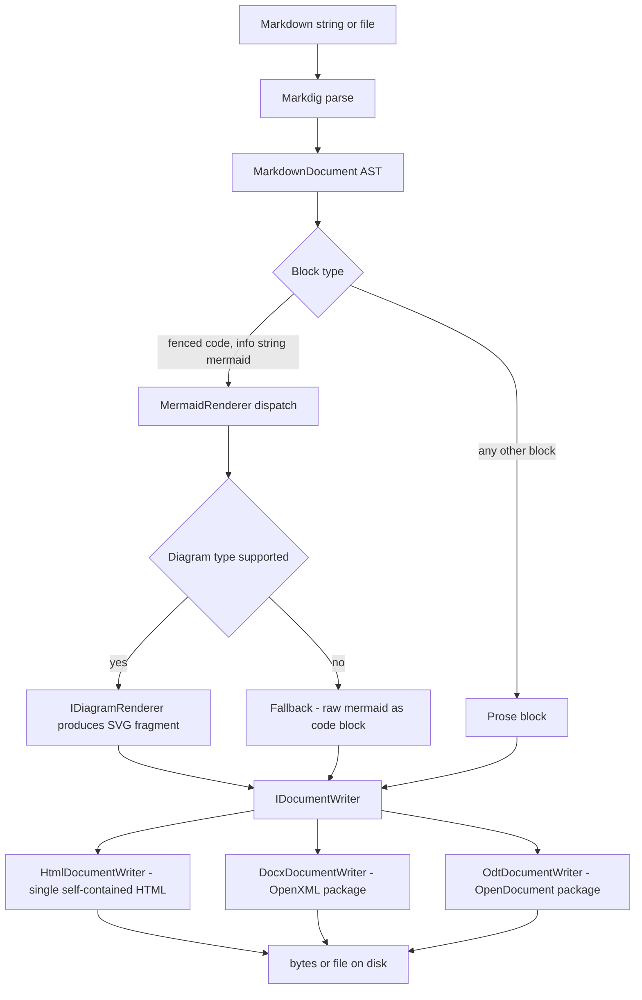

# 02 — Architecture

## Data flow



Stages, in order:

1. **Input.** A Markdown `string` (or a file read into one) plus a `RenderOptions`.
2. **Parse.** Markdig with the advanced/GFM pipeline produces a `MarkdownDocument` AST.
   Markdig is the *only* Markdown parser; we never regex Markdown ourselves.
3. **Walk.** A single pass over the top-level AST identifies `FencedCodeBlock` nodes whose
   info string is `mermaid` (case-insensitive, first word only, so ` ```mermaid ` and
   ` ```mermaid title=x ` both match). Everything else is left untouched as a prose block.
4. **Dispatch.** Each mermaid block's source text goes to `MermaidRenderer`, which reads
   the first significant token (`flowchart`, `graph`, `sequenceDiagram`, …) and looks up an
   `IDiagramRenderer`. A hit produces an SVG fragment; a miss produces a fallback marker
   that the writer emits as a preformatted code block.
5. **Assemble.** The selected `IDocumentWriter` receives the ordered sequence of prose
   blocks and diagram results and produces the final byte stream.

The important structural property: **diagram rendering knows nothing about the output
format**, and **writers know nothing about Mermaid**. The interchange currency between
them is an SVG fragment (plus its intrinsic width/height) or a fallback code block.

## Component responsibilities

| Component | Responsibility | Knows about |
| --- | --- | --- |
| `MarkdownRenderer` | Orchestration: parse, walk, dispatch, hand to writer | Markdig, Mermaid engine, `IDocumentWriter` |
| `MermaidBlockExtractor` | Identify mermaid fenced blocks in the AST | Markdig AST only |
| `MermaidRenderer` | Diagram-type detection and renderer lookup | `IDiagramRenderer` registry |
| `IDiagramRenderer` impls | Parse one diagram type, lay it out, emit SVG | Geometry + SVG only |
| `SvgBuilder` | Escaping-safe SVG element emission, text metrics estimation | Nothing else |
| `HtmlDocumentWriter` | Self-contained HTML assembly | Markdig HTML renderer, SVG strings |
| `OdtDocumentWriter` | ODF package assembly | `ZipArchive` + `XmlWriter`, SVG strings |
| `DocxDocumentWriter` | OOXML package assembly | DocumentFormat.OpenXml, SVG strings |

## Proposed solution layout

This is a **design proposal**; no projects are created in this documentation task. Phase 0
([phase-0-scaffolding.md](phases/phase-0-scaffolding.md)) creates it.

```
MarkdownDotNetRenderer.sln
Directory.Build.props
src/
  MarkdownDotNetRenderer.Core/
    MarkdownDotNetRenderer.Core.csproj
    IMarkdownRenderer.cs
    MarkdownRenderer.cs
    RenderOptions.cs
    OutputFormat.cs
    RenderDiagnostic.cs
    Markdown/
      MarkdownPipelineFactory.cs
      MermaidBlockExtractor.cs
    Mermaid/
      IDiagramRenderer.cs
      MermaidRenderer.cs
      DiagramRenderResult.cs
      Flowchart/
        FlowchartParser.cs
        FlowchartModel.cs        // nodes, edges, direction
        LayeredLayout.cs         // Sugiyama-style ranking + ordering + coordinates
        FlowchartRenderer.cs     // IDiagramRenderer for flowchart/graph
      Sequence/                  // phase 3
    Svg/
      SvgBuilder.cs
      TextMetrics.cs
    Writers/
      IDocumentWriter.cs
      HtmlDocumentWriter.cs
      Odt/                       // phase 2
      DocxDocumentWriter.cs      // phase 5
  MarkdownDotNetRenderer.Cli/
    MarkdownDotNetRenderer.Cli.csproj
    Program.cs
tests/
  MarkdownDotNetRenderer.Tests/
    MarkdownDotNetRenderer.Tests.csproj
    ...
build/
  verify.sh                    // authoritative build/test/AOT gate (bash)
  verify.ps1                   // same gate on Windows (PowerShell)
docs/
```

`build/verify.{sh,ps1}` is the definition of a green build; a `.github/workflows/ci.yml` is
optional and must only invoke it ([07-testing-strategy](07-testing-strategy.md)).

`Directory.Build.props` holds the shared `net9.0`, `LangVersion latest`,
`Nullable enable`, `TreatWarningsAsErrors`, and AOT/trim properties so the three project
files stay nearly empty.

## Design constraints that shape the architecture

- **Single pass, no mutation of the Markdig AST.** We read the AST and build our own
  ordered block list. Mutating Markdig nodes to inject HTML would break the ODT and DOCX paths,
  which are not HTML-based.
- **SVG fragments, not full SVG documents.** Diagram renderers emit an `<svg>` element with
  explicit `width`/`height`/`viewBox` and no XML prolog, so HTML can inline it directly and
  the ODF/OOXML writers can store it as a standalone SVG part with a prolog added at that point.
- **Reflection-free Core.** No `Activator.CreateInstance`, no attribute scanning to find
  diagram renderers; the registry is an explicit list/dictionary populated in code. This is
  what keeps `PublishAot` clean.
- **Writers are constructed, not discovered.** `RenderOptions.Format` selects a writer via a
  `switch`, which is also the only place adding an output format touches the pipeline. The DOCX
  writer type lives in Core but is only touched on the DOCX branch, so an HTML- or ODT-only
  consumer never pulls OpenXml code paths at runtime (see
  [06-aot-and-dependencies](06-aot-and-dependencies.md) for the trimming caveat).
- **Determinism.** Same input bytes → same output bytes, on every OS. Package timestamps (DOCX
  core properties, ODF `meta.xml`) are
  pinned to fixed values and rendered text uses `\n` rather than `Environment.NewLine`, so
  golden-file tests are viable across Linux, macOS, and Windows.
- **No platform-specific APIs.** Every output format is written directly as a file-format
  package (HTML text, OOXML zip, ODF zip) — never by automating an installed Office suite — so
  the same code runs on a headless Linux container and on Windows. All numeric formatting is
  `InvariantCulture`, and no code path depends on installed fonts
  ([06-aot-and-dependencies](06-aot-and-dependencies.md)).
- **Errors are diagnostics, not exceptions.** Malformed diagrams degrade; see
  [03-core-api](03-core-api.md).
