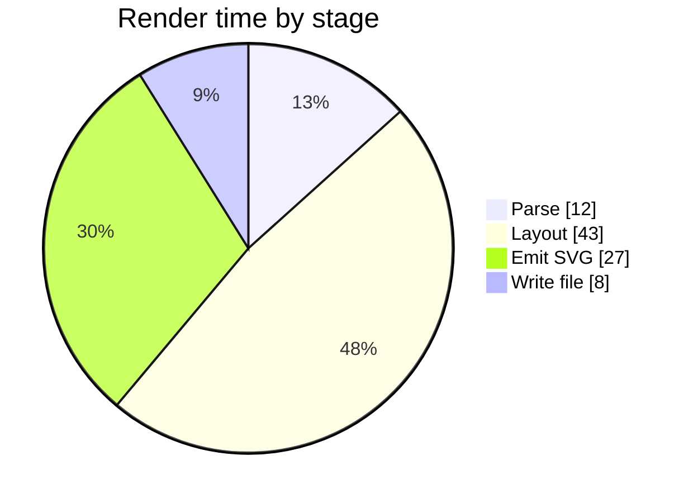
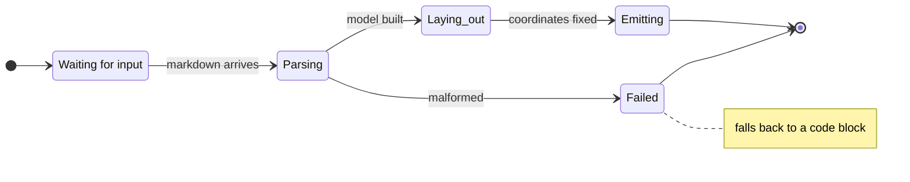
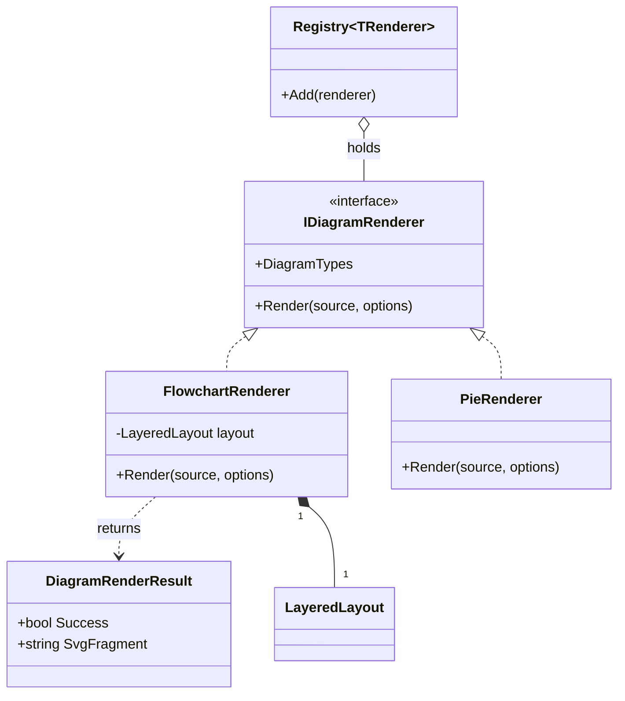
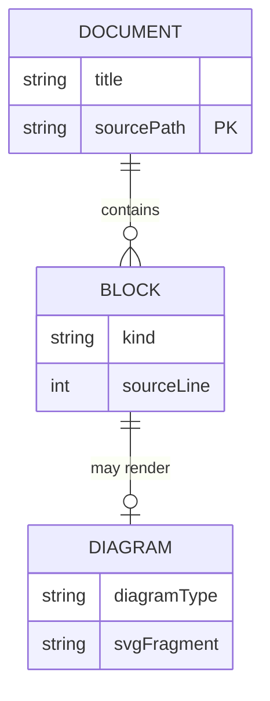
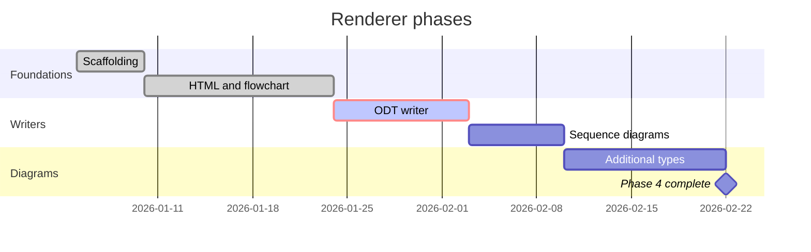

# Diagram gallery

The phase 4 diagram types, each rendered as inline SVG with no JavaScript and no external
resources.

## Pie chart

## State diagram

## Class diagram

## Entity relationship diagram

## Gantt chart

