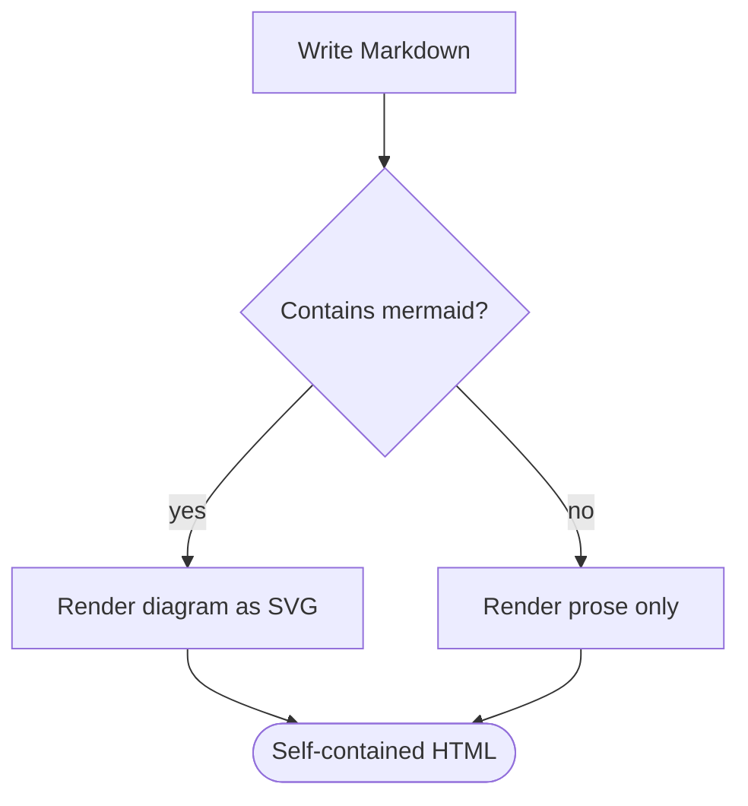
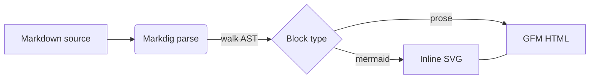

# Flowchart demo

A short document with prose and two mermaid flowcharts, used for manual checks and by the
`build/verify` smoke test.

## Top-down

The release pipeline, drawn top-down:

## Left-to-right

The same idea laid out left-to-right, with an undirected link and a label on the long form:

Both diagrams are hand-written SVG: no JavaScript, no external requests, no fonts to install.
