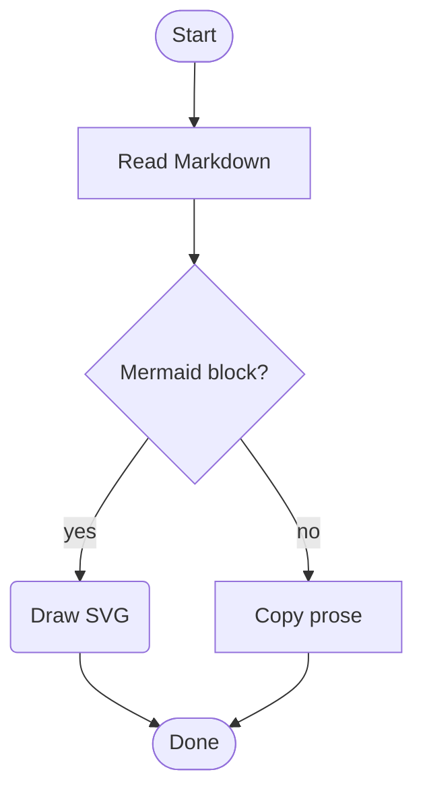
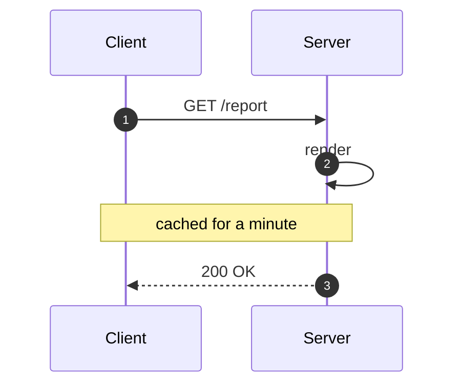
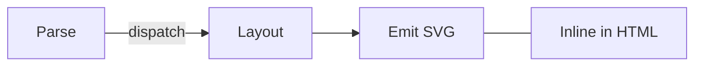
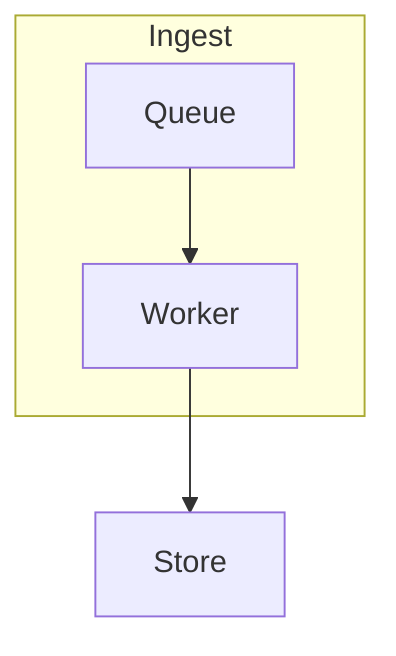

# Kitchen sink

This document exercises every Markdown construct and every mermaid path that phase 1 supports. It
is rendered byte-for-byte into `samples/expected/kitchen-sink.html`, which the golden test compares
against on every platform.

## Inline formatting

Regular text, **bold**, *italic*, ***both***, ~~struck through~~, `inline code`, and a
[relative link](./flowchart-demo.md). Escapes work too: \*not italic\*.

## Lists

1. First item
2. Second item
   - Nested bullet
   - Another nested bullet
3. Third item

- [x] Completed task
- [ ] Outstanding task

## Table

| Feature   | Phase | Status      |
|-----------|:-----:|-------------|
| HTML      |   1   | implemented |
| Flowchart |   1   | implemented |
| ODT       |   2   | later       |

## Block quote and rule

> Deterministic output means the same input always produces the same bytes.
> That is what makes the golden test meaningful.

---

## Fenced code that is not a diagram

```csharp
var renderer = new MarkdownRenderer();
RenderResult result = await renderer.RenderAsync(markdown, new RenderOptions());
```

## Supported diagrams

A top-down flowchart with all four node shapes:



A sequence diagram with an alias, numbered messages, a self-message, and a note:



A left-to-right graph, with a long-form edge label, an undirected link, and a chain:



## Degraded diagrams

An unsupported diagram type falls back to an escaped code block with one `MERMAID001` warning:

```mermaid
gantt
    title Not until phase 4
```

A malformed flowchart falls back with `MERMAID002`:

```mermaid
flowchart TD
    A[Unterminated --> B
    -->
```

Constructs that are recognized but ignored report `MERMAID003` and still render the rest:


