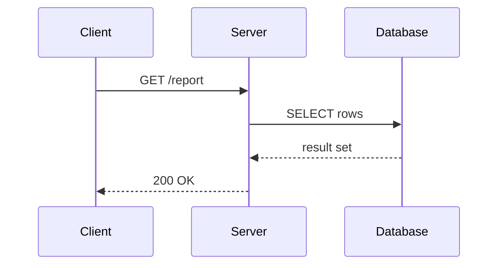
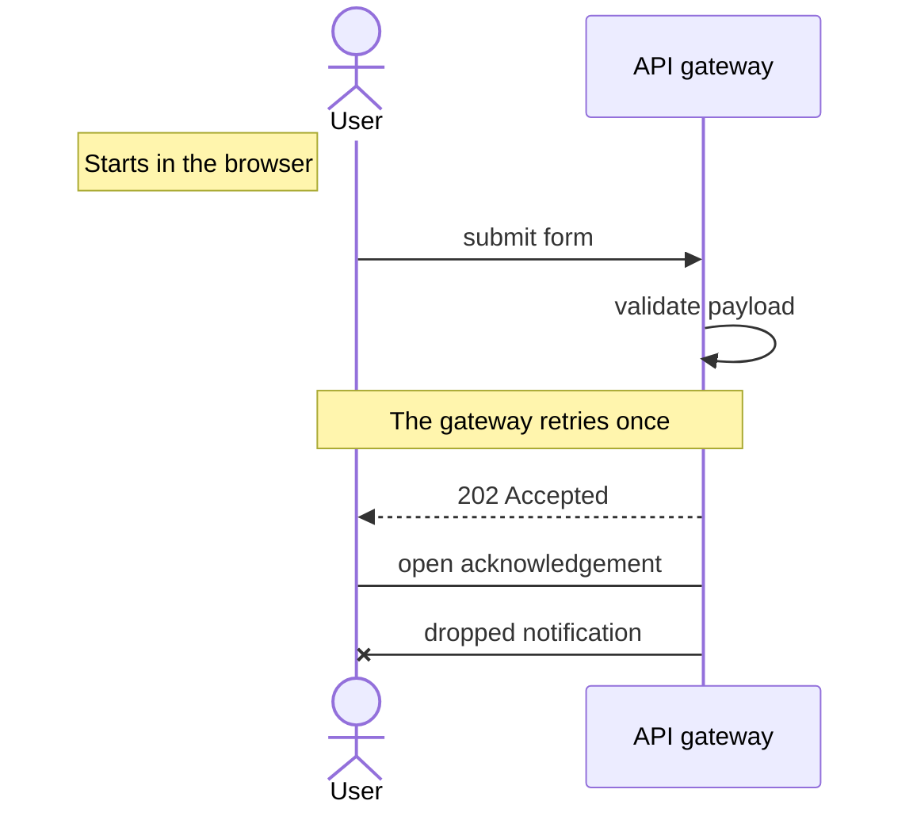
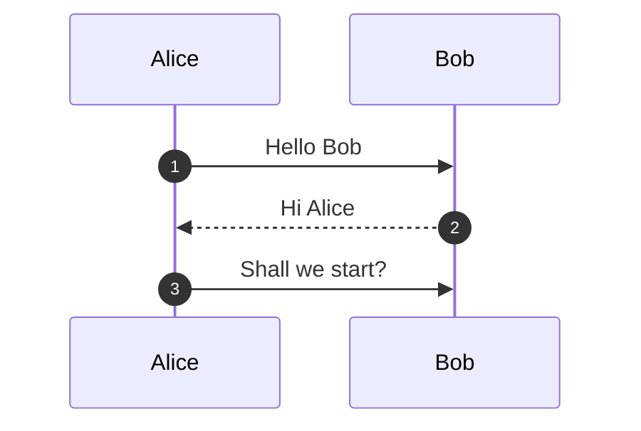
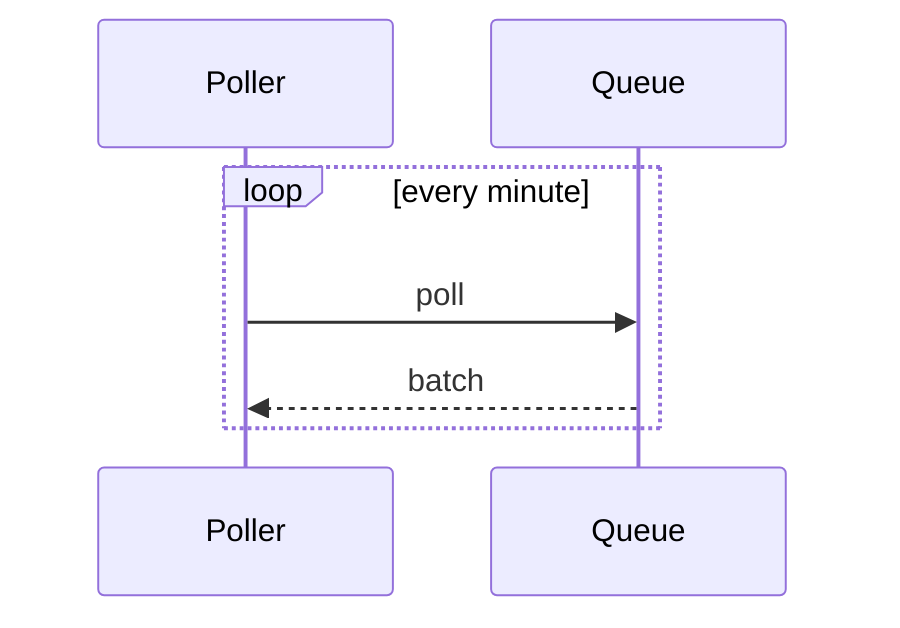

# Sequence demo

A short document with prose and several mermaid sequence diagrams, used for manual checks and by
the `build/verify` smoke test.

## A request/response exchange

## Notes, a self-message, and every arrow style

## Numbered messages

## A fragment, which degrades gracefully

`loop` and friends are not laid out yet: the frame is missing and one `MERMAID003` is reported,
but the messages inside still render in source order.

Every diagram is hand-written SVG: no JavaScript, no external requests, no fonts to install.
